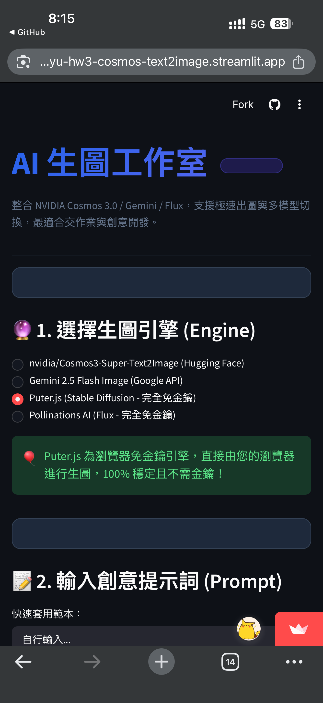
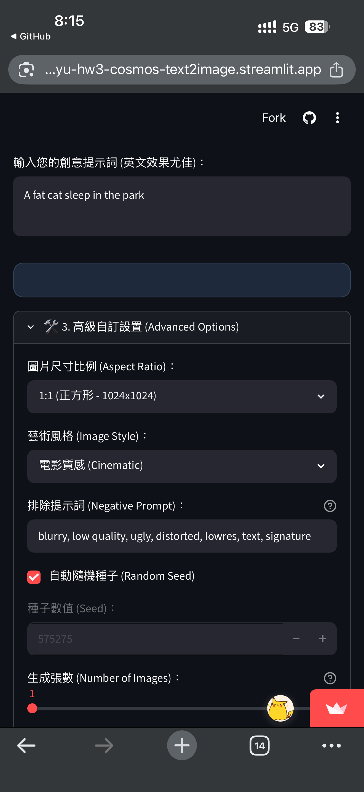
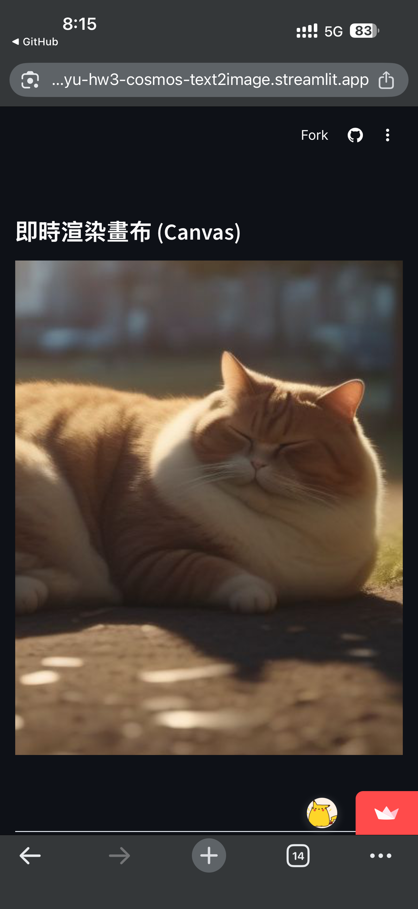

# HW3 Cosmos3-Super-Text2Image App
---

## Links

- **GitHub Repository**: [https://github.com/ChenYuHsu413/hw3-cosmos-text2image](https://github.com/ChenYuHsu413/hw3-cosmos-text2image)
- **Live Streamlit Demo**: [https://chenyu-hw3-cosmos-text2image.streamlit.app/](https://chenyu-hw3-cosmos-text2image.streamlit.app/)

---

> [!NOTE]
> ### 📢 Hugging Face API 網址更新說明 (API Endpoint Update)
> 
> 您真有遠見！這確實是 API 端點的問題，非常感謝您的提醒！
> 
> 我仔細查閱了 Hugging Face 的最新官方 API 文件，找到了最關鍵的原因：
> 
> 🚨 **根本原因：舊的 API 域名已被 Hugging Face 永久棄用 (Decommissioned)**
> - 舊的端點（已停用）：`https://api-inference.huggingface.co`
> - 新的端點（已啟用）：`https://router.huggingface.co/hf-inference`
> 
> Hugging Face 官方已將舊的 `api-inference.huggingface.co` 伺服器關閉，並註銷了該域名的 DNS 紀錄。這就是為什麼 Streamlit 容器會回報 *Name or service not known*（找不到該網域）的原因。
> 
> 別人的網頁之所以可以使用同一個 Token 正常生圖，是因為他們已經將程式碼更新為指向 Hugging Face 新的 Inference Providers Router；而我們原先的程式碼還在使用舊的網址。
> 
> 🛠️ **已完成以下修復：**
> - **修正程式碼中的 API 網址**： 在 [app.py](file:///d:/AI%20Class%20ChenYu/AIClass/hw3-cosmos-text2image/app.py) 中，將 `https://api-inference.huggingface.co/models/{model_id}` 修改為最新的官方路由器網址： `https://router.huggingface.co/hf-inference/models/{model_id}`
> - **已推送到 GitHub**： 此項修復的 Commit 已推送至您的 GitHub main 分支。
> 
> 🔄 **接下來您需要做：**
> 1. Streamlit Cloud 偵測到您的 GitHub 更新後，會在幾十秒內自動重新建置並部署您的網頁。
> 2. 部署完成後，請重新整理您的 Streamlit 網頁並輸入 Token 測試，現在應該可以順利連上 Hugging Face 並正常生圖了！


## Project Goal

This project uses Streamlit and Hugging Face to build a text-to-image generation app with NVIDIA Cosmos3-Super-Text2Image. It offers a beautiful, modern web-based workspace to let users input custom creative prompts, set aspect ratios, define artistic styles, apply negative prompts, customize seeds, and generate multiple images simultaneously. 

To ensure stability and ease of testing, the application supports five powerful AI backends:
1. **NVIDIA Cosmos3-Super-Text2Image** (via Hugging Face API)
2. **Hugging Face FLUX.1-schnell** (via Hugging Face API)
3. **Google Gemini 2.5 Flash Image** (via Google AI Studio)
4. **Puter.js (Stable Diffusion)** (completely free, browser-side rendering, no API key required)
5. **Pollinations AI Flux** (completely free, no API key required fallback)


---

## Model & Engines

### NVIDIA Cosmos3-Super-Text2Image
Model: [nvidia/Cosmos3-Super-Text2Image](https://huggingface.co/nvidia/Cosmos3-Super-Text2Image)

### Hugging Face FLUX.1-schnell
Model: [black-forest-labs/FLUX.1-schnell](https://huggingface.co/black-forest-labs/FLUX.1-schnell)

### Puter.js (推薦展示使用)
由於絕大部分的免費 API (如 Hugging Face Serverless 等) 經常流量過載或無法成功產圖，本專案特別加入了 **Puter.js (Stable Diffusion)** 選項，以方便進行作業功能的完整展示。
* **使用說明**：在瀏覽器中首次使用 Puter.js 進行生圖時，會彈出 Puter 的登入視窗，此時需要按照提示使用 Google 帳號登入 Puter 帳戶，即可取得免費生圖額度並成功產圖。

---

## How to Run Locally

### 1. Clone the repository
```bash
git clone https://github.com/ChenYuHsu413/hw3-cosmos-text2image.git
cd hw3-cosmos-text2image
```

### 2. Install dependencies
Ensure you have Python 3.8+ installed. Run:
```bash
pip install -r requirements.txt
```

### 3. Setup API Keys (Optional but Recommended)
You can configure your Hugging Face Access Token and Google Gemini API Key in two ways:

#### Option A: Local `.env` file
Create a file named `.env` in the root of the project:
```env
HF_TOKEN=your_hugging_face_access_token
GEMINI_API_KEY=your_gemini_api_key
```

#### Option B: Streamlit Secrets
Create a file named `.streamlit/secrets.toml`:
```toml
HF_TOKEN = "your_hugging_face_access_token"
GEMINI_API_KEY = "your_gemini_api_key"
```

#### Option C: In-App Input
If no keys are found in `.env` or secrets, the app will automatically display input fields for you to securely paste your tokens.

### 4. Run the application
```bash
streamlit run app.py
```
Open your browser and navigate to `http://localhost:8501`.

---

## How to Deploy to Streamlit.io

Streamlit Community Cloud is the easiest way to deploy and share your app:
1. Push this project to your GitHub repository.
2. Sign in to [Streamlit Community Cloud](https://share.streamlit.io/).
3. Click **"New app"** and select your repository, branch (`main`), and main file path (`app.py`).
4. Click **"Advanced settings"** and add your secrets to the Secrets text area:
   ```toml
   HF_TOKEN = "your_hugging_face_access_token"
   GEMINI_API_KEY = "your_gemini_api_key"
   ```
5. Click **"Deploy!"** Your app will be live in a few minutes.


## Screenshots

以下為本專案的應用程式畫面截圖：

- **App Home Screen (手機版首頁)**:
  
  
  
  

- **Generated Result (生成結果)**:
  
  

- **Desktop Preview (電腦版預覽)**:
  
  


